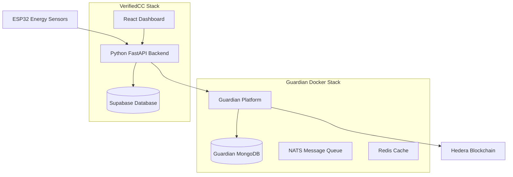
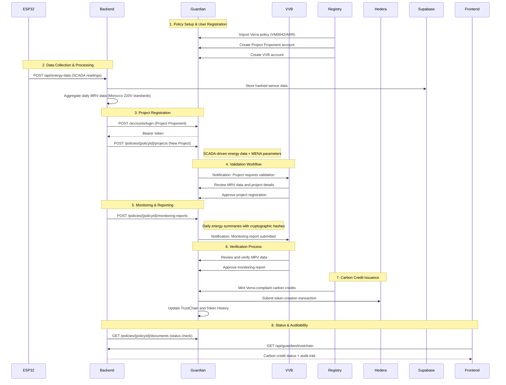

# Design Document

## Overview

This design integrates the Hedera Guardian platform with the VerifiedCC Python backend to create an automated, Verra-compliant carbon credit verification pipeline. The integration leverages Guardian's policy-based verification workflows using Verra open-source policy templates (VM0042, ARR) to process ESP32 energy production data and generate blockchain-verified carbon credits through a complete multi-stakeholder workflow.

The system architecture follows a comprehensive approach supporting the full carbon credit lifecycle:
1. **Data Collection**: ESP32 devices collect real energy production data with SCADA integration
2. **Processing & Aggregation**: Python backend processes and formats data for Verra MRV schema compliance
3. **Multi-Stakeholder Workflow**: Project Proponents, VVBs, and Standard Registry roles with automated assignment
4. **Verification & Tokenization**: Guardian validates data through Verra methodologies and issues carbon credits on Hedera blockchain
5. **Auditability & Trading**: TrustChain and Token History provide transparent audit trails for regulatory compliance and market access

## Architecture

### System Components



### Verra-Compliant Guardian Integration Flow



## Components and Interfaces

### 1. Guardian Authentication Service

**Purpose**: Manages authentication and session handling with Guardian API

**Interface**:
```python
class GuardianAuth:
    def login(username: str, password: str) -> AuthToken
    def refresh_token(token: AuthToken) -> AuthToken
    def logout(token: AuthToken) -> bool
    def is_token_valid(token: AuthToken) -> bool
```

**Implementation Details**:
- Uses Guardian's `/accounts/login` endpoint
- Stores bearer tokens securely in memory
- Implements automatic token refresh before expiration
- Handles authentication failures with retry logic

### 2. Guardian Policy Manager

**Purpose**: Manages Guardian policies and validates data against policy schemas

**Interface**:
```python
class GuardianPolicyManager:
    def get_policies() -> List[Policy]
    def get_policy_schema(policy_id: str) -> PolicySchema
    def validate_data(data: dict, schema: PolicySchema) -> ValidationResult
    def get_policy_blocks(policy_id: str) -> List[PolicyBlock]
```

**Implementation Details**:
- Fetches policies using `/policies` endpoint
- Caches policy schemas to reduce API calls
- Validates energy data against policy requirements
- Maps ESP32 data fields to Guardian schema fields

### 3. Energy Data Aggregator

**Purpose**: Processes ESP32 sensor data into Guardian-compatible reports

**Interface**:
```python
class EnergyDataAggregator:
    def aggregate_daily_data(device_id: str, date: datetime) -> EnergyReport
    def format_for_guardian(report: EnergyReport, policy_id: str) -> dict
    def calculate_verification_hash(data: dict) -> str
    def validate_data_quality(readings: List[dict]) -> QualityMetrics
```

**Implementation Details**:
- Aggregates 24-hour periods of ESP32 data from Supabase
- Calculates energy production metrics (total kWh, average power, efficiency)
- Generates cryptographic hashes for data integrity verification
- Handles missing data points and quality validation

### 4. Guardian Document Submitter

**Purpose**: Submits energy reports to Guardian and tracks verification status

**Interface**:
```python
class GuardianDocumentSubmitter:
    def submit_energy_report(report: EnergyReport, policy_id: str) -> SubmissionResult
    def get_document_status(document_id: str) -> DocumentStatus
    def track_submission_progress(submission_id: str) -> ProgressStatus
    def handle_submission_errors(error: GuardianError) -> RetryAction
```

**Implementation Details**:
- Uses `/policies/{policyId}/tag/{tagName}/blocks` for data submission
- Tracks document IDs and verification status in Supabase
- Implements retry logic for failed submissions
- Monitors Guardian processing pipeline status

### 5. Verra Project Manager

**Purpose**: Manages Verra-compliant project registration and multi-stakeholder workflows

**Interface**:
```python
class VerraProjectManager:
    def register_project(project_data: ProjectRegistration, policy_id: str) -> ProjectResult
    def submit_monitoring_report(report: MonitoringReport, project_id: str) -> ReportResult
    def get_project_status(project_id: str) -> ProjectStatus
    def assign_vvb(project_id: str, vvb_criteria: VVBCriteria) -> AssignmentResult
    def track_verification_progress(project_id: str) -> VerificationStatus
```

**Implementation Details**:
- Uses `/policies/{policyId}/projects` for project registration
- Formats SCADA data according to Verra MRV schema requirements
- Includes MENA-specific parameters (Morocco 220V standards)
- Handles automated VVB assignment and notification workflows
- Tracks multi-stakeholder approval processes

### 6. TrustChain Audit Manager

**Purpose**: Provides transparent auditability and token history for carbon credits

**Interface**:
```python
class TrustChainAuditManager:
    def get_trustchain_data(token_id: str) -> TrustChainRecord
    def get_token_history(token_id: str) -> TokenHistory
    def generate_audit_report(project_id: str, date_range: DateRange) -> AuditReport
    def verify_data_integrity(submission_id: str) -> IntegrityResult
    def export_compliance_data(project_id: str, format: str) -> ComplianceExport
```

**Implementation Details**:
- Accesses Guardian's TrustChain interface for transparent auditability
- Provides Token History sections for dispute resolution
- Generates regulatory compliance reports for producers, auditors, and buyers
- Maintains immutable blockchain records on Hedera
- Supports export formats for various regulatory requirements

## Data Models

### Guardian Integration Models

```python
@dataclass
class GuardianConfig:
    base_url: str = "http://localhost:3000"
    username: str
    password: str
    default_policy_id: Optional[str] = None
    timeout: int = 30
    retry_attempts: int = 3

@dataclass
class AuthToken:
    token: str
    expires_at: datetime
    refresh_token: Optional[str] = None

@dataclass
class GuardianPolicy:
    id: str
    name: str
    description: str
    status: str  # DRAFT, PUBLISH, DRY_RUN, etc.
    schema_requirements: dict
    target_blocks: List[str]

@dataclass
class GuardianSubmission:
    id: str
    device_id: str
    policy_id: str
    document_id: Optional[str]
    status: str  # PENDING, PROCESSING, VERIFIED, FAILED
    submitted_at: datetime
    verified_at: Optional[datetime]
    error_message: Optional[str]
    energy_report: EnergyReport

@dataclass
class VerraProjectRegistration:
    project_name: str
    project_type: str  # VM0042, ARR, etc.
    location: str  # MENA region specifics
    technology: str  # Solar, Wind, etc.
    capacity_kw: float
    grid_voltage: int = 220  # Morocco standard
    mrv_schema: dict  # Verra MRV requirements
    scada_integration: bool = True
    project_proponent: str
    assigned_vvb: Optional[str] = None

@dataclass
class MonitoringReport:
    project_id: str
    reporting_period_start: datetime
    reporting_period_end: datetime
    total_energy_kwh: float
    average_power_kw: float
    data_points_count: int
    verification_hash: str
    scada_data_summary: dict
    mena_compliance_params: dict
    verra_mrv_fields: dict

@dataclass
class VVBAssignment:
    vvb_id: str
    project_id: str
    assignment_date: datetime
    status: str  # ASSIGNED, REVIEWING, APPROVED, REJECTED
    verification_criteria: dict
    notification_sent: bool = False
    
@dataclass
class TrustChainRecord:
    token_id: str
    project_id: str
    carbon_credits_issued: float
    issuance_date: datetime
    verification_trail: List[dict]
    hedera_transaction_id: str
    audit_trail: dict
```

### Database Schema Extensions

```sql
-- Guardian submissions tracking table
CREATE TABLE guardian_submissions (
    id BIGSERIAL PRIMARY KEY,
    created_at TIMESTAMPTZ DEFAULT NOW(),
    
    -- Submission details
    device_id TEXT NOT NULL,
    policy_id TEXT NOT NULL,
    guardian_document_id TEXT,
    
    -- Status tracking
    status TEXT NOT NULL DEFAULT 'PENDING',
    submitted_at TIMESTAMPTZ,
    verified_at TIMESTAMPTZ,
    error_message TEXT,
    
    -- Energy data reference
    period_start TIMESTAMPTZ NOT NULL,
    period_end TIMESTAMPTZ NOT NULL,
    total_energy_kwh REAL NOT NULL,
    data_points_count INTEGER NOT NULL,
    verification_hash TEXT NOT NULL,
    
    -- Guardian response data
    guardian_response JSONB,
    
    FOREIGN KEY (device_id) REFERENCES sensor_readings(device_id)
);

CREATE INDEX idx_guardian_submissions_device_status ON guardian_submissions(device_id, status);
CREATE INDEX idx_guardian_submissions_policy ON guardian_submissions(policy_id, submitted_at DESC);

-- Verra project registrations table
CREATE TABLE verra_projects (
    id BIGSERIAL PRIMARY KEY,
    created_at TIMESTAMPTZ DEFAULT NOW(),
    
    -- Project details
    project_name TEXT NOT NULL,
    project_type TEXT NOT NULL, -- VM0042, ARR, etc.
    guardian_project_id TEXT,
    policy_id TEXT NOT NULL,
    
    -- Location and technical specs
    location TEXT NOT NULL,
    technology TEXT NOT NULL,
    capacity_kw REAL NOT NULL,
    grid_voltage INTEGER DEFAULT 220, -- Morocco standard
    
    -- Stakeholder assignments
    project_proponent TEXT NOT NULL,
    assigned_vvb TEXT,
    registry_admin TEXT,
    
    -- Status tracking
    status TEXT NOT NULL DEFAULT 'DRAFT', -- DRAFT, REGISTERED, ACTIVE, VERIFIED
    registered_at TIMESTAMPTZ,
    
    -- Compliance data
    mrv_schema JSONB NOT NULL,
    mena_compliance_params JSONB,
    verra_methodology TEXT NOT NULL
);

-- VVB assignments and notifications table
CREATE TABLE vvb_assignments (
    id BIGSERIAL PRIMARY KEY,
    created_at TIMESTAMPTZ DEFAULT NOW(),
    
    -- Assignment details
    project_id BIGINT NOT NULL REFERENCES verra_projects(id),
    vvb_id TEXT NOT NULL,
    assigned_by TEXT NOT NULL,
    
    -- Status and workflow
    status TEXT NOT NULL DEFAULT 'ASSIGNED', -- ASSIGNED, REVIEWING, APPROVED, REJECTED
    assignment_date TIMESTAMPTZ DEFAULT NOW(),
    review_completed_at TIMESTAMPTZ,
    
    -- Notifications
    notification_sent BOOLEAN DEFAULT FALSE,
    notification_sent_at TIMESTAMPTZ,
    
    -- Verification criteria and results
    verification_criteria JSONB,
    verification_results JSONB
);

-- Carbon credit tokens and TrustChain records
CREATE TABLE carbon_credit_tokens (
    id BIGSERIAL PRIMARY KEY,
    created_at TIMESTAMPTZ DEFAULT NOW(),
    
    -- Token identification
    token_id TEXT NOT NULL UNIQUE,
    project_id BIGINT NOT NULL REFERENCES verra_projects(id),
    guardian_document_id TEXT,
    
    -- Credit details
    carbon_credits_issued REAL NOT NULL,
    issuance_date TIMESTAMPTZ NOT NULL,
    methodology TEXT NOT NULL,
    
    -- Blockchain records
    hedera_transaction_id TEXT,
    trustchain_data JSONB,
    token_history JSONB,
    
    -- Audit and compliance
    verification_trail JSONB NOT NULL,
    audit_trail JSONB,
    compliance_status TEXT DEFAULT 'ACTIVE'
);

CREATE INDEX idx_verra_projects_status ON verra_projects(status, created_at DESC);
CREATE INDEX idx_vvb_assignments_project ON vvb_assignments(project_id, status);
CREATE INDEX idx_carbon_tokens_project ON carbon_credit_tokens(project_id, issuance_date DESC);
```

## Error Handling

### Guardian Connection Errors

**Scenario**: Guardian API is unreachable or returns HTTP errors

**Handling Strategy**:
1. Implement exponential backoff retry logic
2. Queue submissions for later retry when Guardian is available
3. Log detailed error information for troubleshooting
4. Provide fallback mode that continues collecting data without Guardian

**Implementation**:
```python
class GuardianRetryHandler:
    def __init__(self, max_retries=3, base_delay=1.0):
        self.max_retries = max_retries
        self.base_delay = base_delay
    
    async def retry_with_backoff(self, operation, *args, **kwargs):
        for attempt in range(self.max_retries):
            try:
                return await operation(*args, **kwargs)
            except GuardianConnectionError as e:
                if attempt == self.max_retries - 1:
                    raise
                delay = self.base_delay * (2 ** attempt)
                await asyncio.sleep(delay)
```

### Authentication Failures

**Scenario**: Guardian authentication fails or tokens expire

**Handling Strategy**:
1. Automatic re-authentication on token expiration
2. Secure credential storage and rotation
3. Graceful degradation when authentication is unavailable
4. Clear error messages for credential configuration issues

### Data Validation Errors

**Scenario**: ESP32 data doesn't match Guardian policy schema requirements

**Handling Strategy**:
1. Detailed validation error logging with field-level feedback
2. Data transformation attempts to match schema requirements
3. Partial submission support for incomplete data sets
4. Schema evolution handling for policy updates

## Testing Strategy

### Unit Tests

**Guardian Service Tests**:
- Mock Guardian API responses for all endpoints
- Test authentication flow with valid/invalid credentials
- Validate data transformation and schema mapping
- Test error handling and retry logic

**Data Aggregation Tests**:
- Test daily energy data aggregation with various data patterns
- Validate calculation accuracy for energy metrics
- Test handling of missing or invalid sensor readings
- Verify data quality assessment algorithms

### Integration Tests

**Guardian API Integration**:
- Test against local Guardian Docker instance
- Validate complete submission workflow from ESP32 to Guardian
- Test policy discovery and schema validation
- Verify document status tracking and updates

**End-to-End Tests**:
- Full pipeline test: ESP32 → Backend → Guardian → Hedera
- Test with real Guardian policies and schemas
- Validate carbon credit generation and tracking
- Test dashboard display of Guardian verification status

### Performance Tests

**Load Testing**:
- Test Guardian API rate limits and concurrent submissions
- Validate system performance with multiple ESP32 devices
- Test database performance with large volumes of Guardian submissions
- Measure Guardian response times under various loads

**Reliability Tests**:
- Test system behavior during Guardian downtime
- Validate data integrity during network interruptions
- Test recovery after Guardian service restarts
- Verify queue processing and retry mechanisms

## Security Considerations

### Credential Management

- Store Guardian credentials in environment variables or secure vault
- Use encrypted storage for authentication tokens
- Implement credential rotation policies
- Audit access to Guardian API credentials

### Data Integrity

- Generate cryptographic hashes for all submitted energy data
- Validate data integrity before Guardian submission
- Implement tamper detection for sensor readings
- Maintain audit trails for all Guardian interactions

### API Security

- Use HTTPS for all Guardian API communications
- Implement request signing for sensitive operations
- Validate Guardian SSL certificates
- Rate limit Guardian API requests to prevent abuse

## Deployment Configuration

### Environment Variables

```bash
# Guardian Configuration
GUARDIAN_URL=http://localhost:3000
GUARDIAN_USERNAME=your_guardian_username
GUARDIAN_PASSWORD=your_guardian_password
GUARDIAN_DEFAULT_POLICY_ID=optional_default_policy

# Guardian Docker Configuration
GUARDIAN_OPERATOR_ID=0.0.xxxxx
GUARDIAN_OPERATOR_KEY=302e020100...
GUARDIAN_HEDERA_NET=testnet
```

### Docker Compose Integration

The system will integrate with Guardian's existing Docker Compose setup:

```yaml
# Add to existing docker-compose.yml
services:
  verifiedcc-backend:
    build: ./b
    ports:
      - "5000:5000"
    environment:
      - GUARDIAN_URL=http://guardian-service:3000
    depends_on:
      - guardian-service
    networks:
      - guardian-network

networks:
  guardian-network:
    external: true
```

### Guardian Policy Setup

The system requires a Guardian policy configured for renewable energy verification:

1. **Policy Schema**: Defines required fields for energy production data
2. **Verification Blocks**: Configures automated verification steps
3. **Token Generation**: Sets up carbon credit token creation rules
4. **Role Permissions**: Defines who can submit and verify energy data

## Verra Compliance Workflow Implementation

### Step-by-Step Carbon Credit Issuance Process

The system implements the complete Verra-compliant workflow as follows:

#### Phase 1: Data Pipeline Preparation
1. **SCADA Integration**: ESP32 devices capture real-time energy production with cryptographic hashing
2. **TLS Security**: All data transmission uses secure, encrypted APIs
3. **MRV Mapping**: Energy data is mapped to Guardian's Verra policy MRV schema requirements

#### Phase 2: Guardian Configuration and Policy Setup
1. **Policy Import**: Import relevant Verra policy templates (VM0042 for renewable energy projects)
2. **User Account Creation**: 
   - Project Proponent (renewable energy operator)
   - VVB (Validation and Verification Body)
   - Registry Administrator (Standard Registry role)
3. **Role Assignment**: Configure appropriate permissions and workflow access

#### Phase 3: Project Registration and Approval
1. **Project Submission**: Project Proponent submits registration with SCADA data integration
2. **Document Upload**: Required documents including design, data schemas, monitoring plans
3. **Registry Review**: Registry admin and VVB review and approve project application
4. **MENA Compliance**: Include Morocco-specific parameters (220V grid, regional standards)

#### Phase 4: Monitoring and Verification Cycle
1. **Continuous MRV**: Real-time SCADA data transmission to Guardian
2. **Periodic Reports**: Automated submission of monitoring reports (daily/monthly)
3. **VVB Verification**: Third-party verification of digital MRV data
4. **Quality Assurance**: Validation against methodology and regulatory requirements

#### Phase 5: Carbon Credit Issuance and Trading
1. **Final Approval**: Registry admin reviews verified monitoring reports
2. **Token Minting**: Guardian mints Verra-compliant carbon credit tokens (VCUs)
3. **Hedera Registration**: Tokens registered on Hedera blockchain
4. **TrustChain Access**: Audit trails available for buyers and regulatory compliance

### Automated Workflow Components

```python
class VerraWorkflowOrchestrator:
    def __init__(self):
        self.project_manager = VerraProjectManager()
        self.vvb_manager = VVBAssignmentManager()
        self.audit_manager = TrustChainAuditManager()
    
    async def execute_daily_workflow(self):
        # 1. Aggregate daily SCADA data
        daily_reports = await self.aggregate_daily_energy_data()
        
        # 2. Submit monitoring reports for active projects
        for report in daily_reports:
            await self.project_manager.submit_monitoring_report(report)
        
        # 3. Check for VVB assignments needed
        pending_projects = await self.get_pending_verification_projects()
        for project in pending_projects:
            await self.vvb_manager.assign_vvb(project)
        
        # 4. Process completed verifications
        verified_reports = await self.get_verified_reports()
        for report in verified_reports:
            await self.process_carbon_credit_issuance(report)
```

This design provides a comprehensive, Verra-compliant integration between VerifiedCC and Guardian, enabling automated carbon credit verification for ESP32-based renewable energy monitoring systems with full multi-stakeholder workflow support and regulatory auditability.